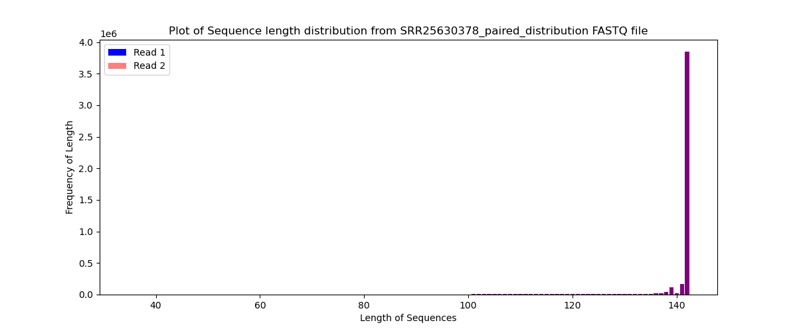

```{r setup, include=FALSE}
knitr::opts_chunk$set(echo = TRUE)
```

# Information on Dataset

I did analysis on SRR25630300 (Crh_rhy53_EO_6cm_1) and SRR25630378 (CcoxCrh_comrhy113_EO_adult_1).

I used `prefetch` to get the `sra` file from NCBI. I then used `fasterq-dump` to get the `fastq` files. I got 2 for each sample: read 1 and read 2. I finally used `gzip` to zip each of these files.

# Part 1 - Read quality score distributions

### Conda Enviroment

I used `conda create –-QAA` to create a new environment.

## FastQC

I ran `fastqc` on all 4 files to get quality score distribution plots per base pair and n content per base pair. I then ran my own script that creates quality score distribution plots per base pair. This script is `./part1/demultiplex_part1_script.py`

### Crh Read 1

Below are the per base quality scores of Crh Read 1. **Figure 1** is produced by FastQC and **Figure 2** is from the demultiplex script. These two graphs look very similar, each showing a slight decrease in quality score as the base position increases (this is normal as the sample starts to degrade as time passes). All of the values match up with one another: none of the values go below 34 and start off above 36.

The FastQC took 100% CPU for 4 minutes and 20 seconds. The demultiplex script took 99% CPU and 28 minute sand 51 seconds to run. It looks like the demulitplex script took about 7 times longer than FastQC. This makes sense because the demultiplex script was not optimized for speed.


Below in **Figure 3** is an plot of the per base N content for Chr read 1. As seen in the graph, the N content (red line) is so small that it looks like it is 0 the entire way through, indicating that almost all the base pairs were sequenced.


### Chr Read 2

Below are the per base quality scores of Crh Read 2. **Figure 4** is produced by FastQC and **Figure 5** is from the demultiplex script. These two graphs look very similar, each showing a slight decrease in quality score as the base position increases (this is normal as the sample starts to degrade as time passes). All of the values match up with one another: the values at the end reach right above 34 and they start off around and then go up above 36.

The FastQC took 99% CPU for 4 minutes and 27 seconds. The demultiplex script took 99% CPU and 29 minutes and 38 seconds to run. It looks like the demulitplex script took about 7 times longer than FastQC. This makes sense because my script was not optimized for speed.


Below in **Figure 6** is a plot of the per base N content for Chr read 2. As seen in the graph, the N content (red line) is so small that it looks like it is 0 the entire way through, indicating that almost all the base pairs were sequenced.


### Cco X Crh Read 1

Below are the per base quality scores of Cco X Crh Read 1. **Figure 7** is produced by FastQC and **Figure 8** is from the demultiplex script. These two graphs look very similar, each showing a slight decrease in quality score as the base position increases (this is normal as the sample starts to degrade as time passes). All of the values match up with one another: the values at the end reach right above 34 and they start off around and then go up above 36.

The FastQC took 101% CPU for 33 seconds. The demultiplex script took 98% CPU and 3 minutes and 13 seconds to run. It looks like the demulitplex script took about 6 times longer than FastQC. This makes sense because my script was not optimized for speed.


Below in **Figure 9** is a plot of the per base N content for Cco X Crh read 1. As seen in the graph, the N content (red line) is so small that it looks like it is 0 the entire way through.


### Cco X Crh Read 2

Below are the per base quality scores of Cco X Crh Read 2. **Figure 10** is produced by FastQC and **Figure 11** is from the demultiplex script. These two graphs look very similar, each showing a slight decrease in quality score as the base position increases (this is normal as the sample starts to degrade as time passes). All of the values match up with one another: the values at the end reach right above 34 and they start off around and then go up above 36.

The FastQC took 105% CPU for 31 seconds. The demultiplex script took 99% CPU and 3 minutes and 16 seconds to run. It looks like the demulitplex script took about 6 times longer than FastQC. This makes sense because my script was not optimized for speed.


Below in **Figure 12** is a plot of the per base N content for Cco X Crh read 2. As seen in the graph, the N content (red line) is so small that it looks like it is 0 the entire way through.


### Overall Results

The FastQC program would have given a warning if the percent of N was above 5% and an error if above 20%. It would have given a warning if the lower quartile for any base quality score is less than 10, or if the median is less than 25. It would give an error if the lower quartile is less than 5 or if the median is less than 20. Since there were no warnings, let alone an error, all the quality scores are high in the very good quality scores (green section), and the percent of N content is very low, I believe that this data is high enough quality to use for further analysis.

# Part 2 - Adaptor trimming comparison

To trim the adaptors, I used Cutadapt version 5.1 and Trimmomatic version 0.40.

The adapters used in the data are: `AGATCGGAAGAGCACACGTCTGAACTCCAGTCA` for read 1 and `AGATCGGAAGAGCGTCGTGTAGGGAAAGAGTGT` for read 2.

## Cutadapt

### Crh Reads

There were a total of 42,812,603 read pairs processed using Cutadapt. In read 1, 2,137,174 (5.0% of total reads) had the adapter and were trimmed. In read 2, 2,433,652 (5.7% of total reads) had the adapter and were trimmed.

### Cco X Crh Reads

There were a total of 4,764,351 read pairs processed using Cutadapt. In read 1, 513,964 (10.8% of total reads) had the adapter and were trimmed. In read 2, 543,582 (11.4% of total reads) had the adapter and were trimmed.

## Trimmomatic

### Crh

Below is **Figure 13** that show the distribution of sequence lengths that have been trimmed. There looks to be so much overlap between read 1 and read 2 that all of the bars are purple (overlap) and hardly any show just read 1 or read 2. Looking back at the Per Base Sequence Quality of read 1 and read 2 in **Figure 1** and **Figure 4**, there isn't much difference in the base pair qualities. Since there isn't much difference, I don't expect there to be much difference in trimming.


### Cco X Crh

Below is **Figure 14** that show the distribution of sequence lengths that have been trimmed in the Cco X Crh reads. Similar to Crh, there is so much overlap between read 1 and read 2 that all of the bars are purple (overlap) and hardly any show just read 1 or read 2. Looking back at the Per Base Sequence Quality of read 1 and read 2 in **Figure 7** and **Figure 10**, there isn't much difference in the base pair qualities. Since there isn't much difference, I don't expect there to be much difference in trimming.



# Part 3

## Mapped and Unmapped Reads

Below is a table that contains the amount of reads that are mapped and unmapped to the reference genome for Crh and the Cco X Crh hybrid. The Crh had 3 times as many mapped reads than unmapped reads. The Cco X Crh hybrid has fairly similar amounts of mapped and unmapped reads, but slightly more unmapped reads.

```{r}

map_unmap_table <- data.frame(
  Species = c("Crh", "Ccoxcrh"),
  Mapped = c("23,027,782" , "5,322,689"),
  Unmapped = c("7,397,353", "7,397,353")
)

library(kableExtra)
    
kbl(map_unmap_table) %>% 
   kable_styling(latex_options = "striped") %>% 
  column_spec(1:2, width = "6em") %>% 
  column_spec(1:2, border_left = TRUE, border_right = TRUE) 

```

## Strandedness

### Crh Strandedness

The stranded file for Crh had a total of 26,415,203, and 633,155 of those reads were mapped to the reference genome. This means that 2.395% of these reads are stranded.

The unstranded file for Crh had a total of 26,415,203, and 14,461,784 of those reads were not mapped (unmapped) to the reference genome. This means that 54.748% of these reads are unstranded.

I believe that the Crh data is not strand-specific because 2.395% of the reads are stranded as opposed to 54.748% of the reads that are unstranded. Moving forward, the `--stranded = reverse` parameter should be used for counting reads and differential gene expression analysis.

### Cco X Crh Strandedness

The stranded file for Cco X Crh had a total of 5,753,939, and 144,239 of those reads were mapped to the reference genome. This means that 2.507% of these reads are stranded.

The unstranded file for Cco X Crh had a total of 5,753,939, and 3,004,550 of those reads were not mapped (unmapped) to the reference genome. This means that 52.217% of these reads are unstranded.

I believe that the Cco X Crh data is not strand-specific because 2.507% of the reads are stranded as opposed to 52.217% of the reads that are unstranded. Moving forward, the `--stranded = reverse` parameter should be used for counting reads and differential gene expression analysis.
